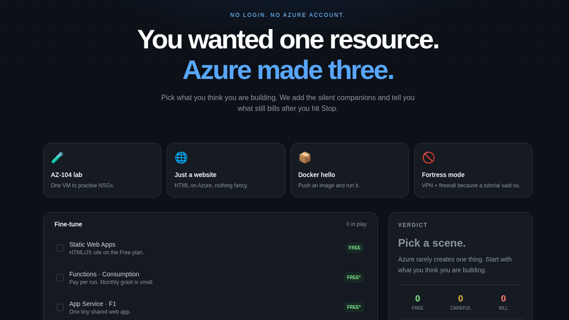

# Will Azure Bill Me?

<p align="center">
  <a href="https://sandeshog.github.io/will-azure-bill-me/"></a>
</p>

<p align="center">
  <a href="https://sandeshog.github.io/will-azure-bill-me/"><strong>Live → sandeshog.github.io/will-azure-bill-me</strong></a>
</p>

<p align="center">
  
  
  
  
</p>

**Will Azure bill me?** is a free-tier billing calculator for students and builders.

You pick what you think you are deploying. The tool adds Azure’s silent companions (disk, public IP, …) and tells you what still bills after you hit Stop — before the invoice lands.

## Who it is for

- Students on **Azure free tier** who are scared of surprise charges
- Builders spinning up a VM / website / container for a lab
- Anyone who wants a fast answer without opening Cost Management

## Features

| Area | What you get |
|---|---|
| Scene presets | AZ-104 lab, website, Docker, fortress mode |
| Resource list | Free / careful / will-bill tags |
| Silent companions | VM → disk + public IP and more |
| Verdict | What bills even after Stop / deallocate |
| Share | Copy a scene link |

No login. No subscription. Rules live in `data/rules.json`.

## Live demo

**[https://sandeshog.github.io/will-azure-bill-me/](https://sandeshog.github.io/will-azure-bill-me/)**

## Stack

Next.js · TypeScript · Tailwind CSS · static rules engine

## SEO keywords

Azure free tier · will Azure bill me · Azure billing calculator · free tier traps · cloud cost for students · silent companions · deallocate still bills

## Run locally

```bash
git clone https://github.com/SandeshOG/will-azure-bill-me.git
cd will-azure-bill-me
npm i
npm run dev
```

Open [http://localhost:3000](http://localhost:3000).

Static export (GitHub Pages):

```bash
npm run build
```

## License

MIT · [Sandesh Lanjewar](https://github.com/SandeshOG)

Educational estimates from published free-tier patterns — not official Microsoft billing advice.
